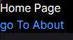

# Navigating Between Pages in Next.js

## Introduction

Navigating between pages in a Next.js application is straightforward using the built-in `Link` component and the `useRouter` hook.

## Using the `Link` Component

The `Link` component is used to create client-side transitions between routes, which is faster than traditional page reloads.

### Example

Create a navigation link in your component:


```jsx
import Link from 'next/link';

export default function HomePage() {
  return (
      <div>
        <h1>Home Page</h1>
        <Link href="/about">
          <h2>go To About</h2>
        </Link>
      </div>
  );
}
```

### Styling Links

You can apply styles to the `Link` component's child element:



```javascript
<Link href="/about">
  <h2 className="text-blue-500">About Page</h2>
</Link>
```

## Using the `useRouter` Hook

The `useRouter` hook provides access to the router object, enabling programmatic navigation.

### Example

Navigate programmatically using `useRouter`:

```javascript
import { useRouter } from 'next/router';

export default function HomePage() {
  const router = useRouter();

  const navigateToAbout = () => {
    router.push('/about');
  };

  return (
    <div>
      <h1>Home Page</h1>
      <button onClick={navigateToAbout}>Go to About Page</button>
    </div>
  );
}
```

## Customizing the `Link` Component

You can pass additional attributes to the `Link` component, such as `replace`, `scroll`, and `shallow`.

1. `replace`: Replaces the current history state instead of adding a new entry.
2. `scroll`: Scrolls to the top of the page after navigation if set to `true`.
3. `shallow`:  Updates the path without running data fetching methods again.

### Example

```javascript
<Link href="/about" replace>
  <a>About Page</a>
</Link>
```

## Conclusion

Using the `Link` component and the `useRouter` hook in Next.js simplifies navigation between pages, providing a faster and more interactive experience.

For detailed information, visit [Next.js Navigating Between Pages](https://nextjs.org/learn/dashboard-app/navigating-between-pages).